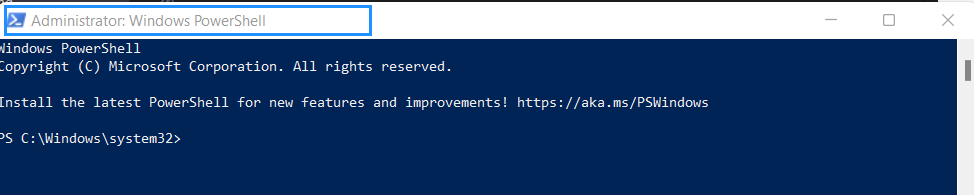
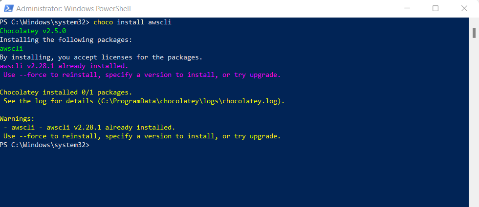
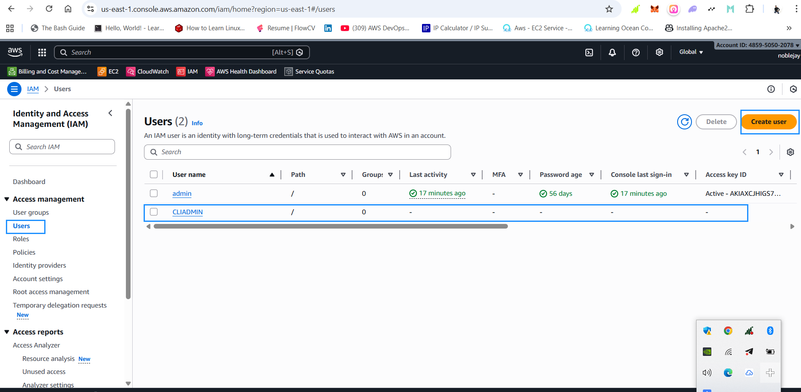
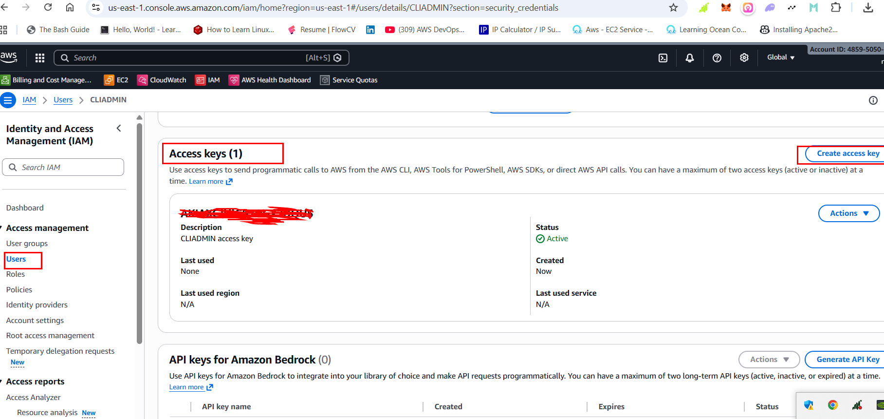
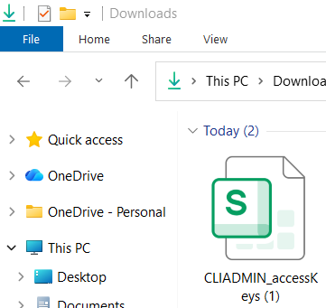
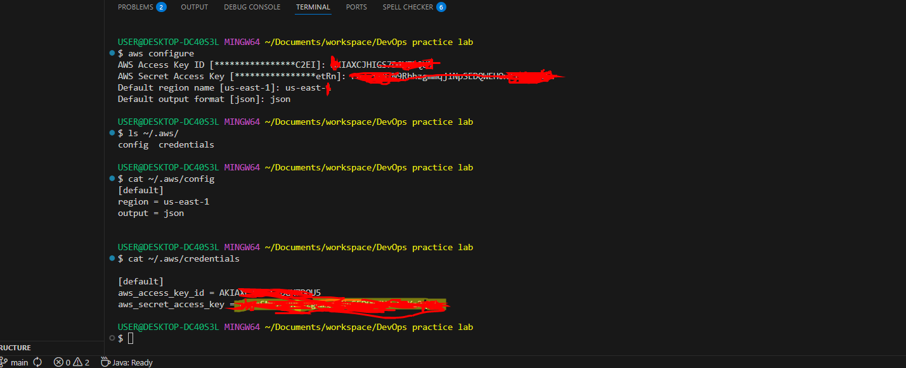
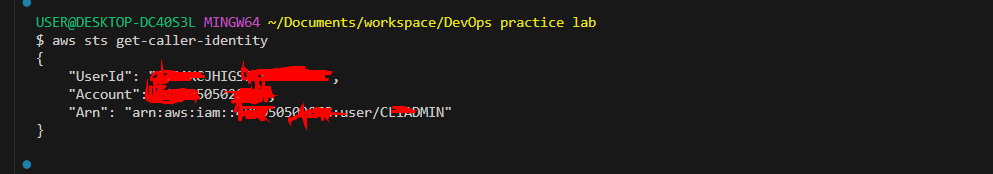
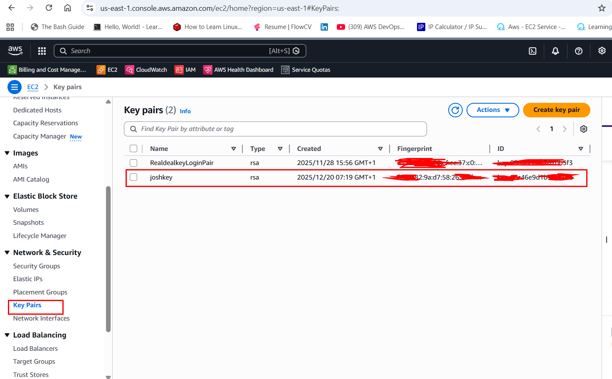
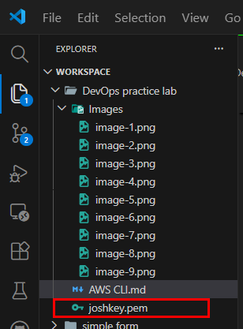
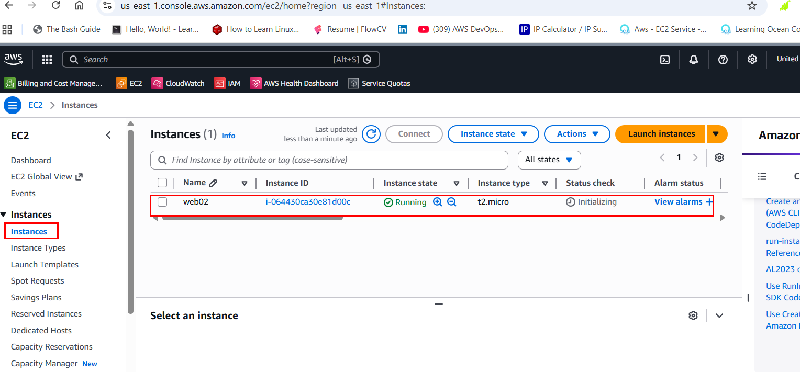

# Amazon CLI or command line interface

This project demonstrates my ability to securely configure AWS CLI access, manage AWS resources programmatically, and apply DevOps principles such as automation, security awareness, and infrastructure management through the command line.
___

## TASK

The scope of this project included the following tasks:

1. Install AWS CLI on a Windows system
2. Create an IAM User with Administrative Access
3. Generate and Secure Access Keys
4. Generate and Secure Access Keys
5. Configure AWS CLI Authentication
6. Validating AWS CLI Authentication
7. List EC2 Instances Using AWS CLI
8. Create an EC2 Key Pair Using AWS CLI
9. Create a Security Group Using AWS CLI
10. Launch an EC2 Instance via AWS CLI

___

## 1. Install AWS CLI on a Windows system

I installed the AWS Command Line Interface (CLI) on my Windows system to enable interaction with AWS services directly from the command line instead of using only the AWS Management Console
___
**Objective:**

To set up the AWS Command Line Interface (CLI) on my Windows system for managing AWS services via commands.

___

**Procedure:**

I completed the process using the following steps

- I opened the Windows Start menu and typed PowerShell into the search box
- I launched PowerShell with administrator privileges.
- Next, I executed the command below:

```powershell
choco install awscli
```

- I followed the prompts and waited for the installation to complete




___

**Outcome:**

The AWS CLI was successfully installed on my Windows machine and is ready for configuration with aws configure.

___

## 2. Create an IAM User with Administrative Access

I created a dedicated IAM user to allow secure programmatic access to AWS services. Administrative access was granted to the user to ensure full permission during learning and lab activities.
___
**Objective:**

To create an AWS IAM user with administrative privileges for CLI and DevOps operations.
___

**Setting an authentication key for user:** Username and password authentication is used for the AWS Management Console, while command-line authentication is done using access keys.

**Step i followed:**

- I logged into the AWS Management Console and searched for **IAM** service in the search bar and selected the **IAM**
- Under the **IAM Dashboard**, I navigated to Users and clicked on **Create user**
- I entered the username **CLIADMIN** and clicked **Next**.
- I selected **Attach policies directly** under **Permissions options**
- With policy list, i assigned the **AdministratorAccess policy.**
- After i have Reviewed user details and attached policies in the steps above, i proceeded to **Create user**
- The IAM user named **CLIADMIN** was successfully created.

___



**Outcome:**

The IAM user CLIADMIN was created successfully with full administrative permissions via the AdministratorAccess policy and is ready for further configuration, including MFA, access keys, and AWS CLI setup.
___

## 4. Generate and Secure Access Keys

I generated access keys for the IAM user to enable authentication when using the AWS CLI. These keys serve as secure credentials for executing AWS commands
___

**Objective:**

To create a separate IAM user specifically for programmatic access using the AWS CLI. This user will be used to authenticate and run AWS commands from the terminal instead of logging in through the AWS Management Console.

___

**Method:**

Below are the steps I took:

- After successfully creating the IAM user, I clicked on the user named **CLIADMIN**.
- From the user details page, I selected the Security credentials tab to manage access keys and authentication settings.
- I scrolled down to the **Access keys** section., i selected **Create access key**
- I followed the on-screen instructions and selected the required options to generate the access key successfully
- I stored it safely in my Downloads folder so I can use it anytime for AWS CLI commands
- For security reasons, I will never upload this key to GitHub or any public place.
- I clicked Download .csv file to save my access key on my local machine.
- My access key is now ready for use on my local machine.

___





**Outcome:**

Access key and secret key are generated and saved securely.

___

## 5. Configure AWS CLI Authentication

___

**Objective:**

To configuring AWS CLI authentication

___

**Procedure:**

AWS CLI authentication is the process of configuring secure credentials on a local machine to access AWS services. I typically create an IAM user above with programmatic access, configure the AWS CLI using the access key and secret key, and optionally define a default region and output format. This setup ensures secure, authenticated, and auditable access to AWS resources from the terminal.

I completed the process using the following steps:

- I launched Visual Studio Code and opened Git Bash as my preferred terminal.
- I ran the following command to configure my AWS CLI with the access key I created:

```powershell
aws configure
```

- I followed the on-screen prompts and entered the correct details for Access Key, Secret Key, Default region (us-east-1), and Output format as json.
- This set up my AWS CLI to interact with my AWS account directly from the terminal.
- After completing the AWS CLI setup, configuration files are automatically created on my machine. To verify and view these files, I ran the following command in Git Bash or terminal:

```powershell
ls ~/.aws/
```

- This displays the **config** and **credentials files**, which stores my region, output format, and access keys securely.


___

**Outcome:**

AWS CLI configuration files was created.

___

## 6. Validating AWS CLI Authentication

___

**Objective:**

To validating AWS CLI authentication

___

The step I followed is as follow:

- To check connectivity and permissions, I executed the command below to validate Using IAM Identity.

```powershell
aws sts get-caller-identity
```



_NB: If there was error after running the command `aws sts get-caller-identity`, i am expected to execute the `aws config` on the command line again for teh second time to add my access key and other credentials correctly. But in a no error so am good to go_
___

**Outcome:**

AWS account ID and IAM user details are returned.

___

## 7. List EC2 Instances Using AWS CLI

___

- I run the command below to get the list of available EC2 instance in my configured region

```powershell
aws ec2 describe-instances
```

**Outcome:**

- My EC2 instance details are displayed in JSON format

___

## 8. Create an EC2 Key Pair Using AWS CLI

___

In AWS, an EC2 Key Pair is used for securely connecting to your EC2 instances via SSH. It consists of a public key stored in AWS and a private key that you download and use to authenticate.

- I run the following command to create and save my private key to .pem file, i named the private key as **joshkey**

```powershell
aws ec2 create-key-pair --key-name joshkey --query 'KeyMaterial' --output text > joshkey.pem
```

- I set proper permission which that only me can read it with the command

```powershell
chmod 400 joshkey.pem
```

- Again, i run the following command to see my private key created

```powershell
cat joshkey.pem
```





NB:

- Always store the .pem file securely — treat it like a password
- Use different key pairs for different environments for security.
- Avoid sharing private keys; use IAM and security groups for access control.

___

## 9. Create a Security Group Using AWS CLI

___

- I run the command to create my security group with the name **joshsecurity** with rule 22 from myip and 80 from anywhere

```powershell
# Get and save my IP address to a variable
MY_IP=$(curl -s https://checkip.amazonaws.com)
echo "Your IP address is: $MY_IP"

# I use it in my security group commands
aws ec2 create-security-group --group-name joshsecurity --description "security group with SSH from my IP and HTTP from anywhere"

aws ec2 authorize-security-group-ingress --group-name joshsecurity --protocol tcp --port 22 --cidr $MY_IP/32

aws ec2 authorize-security-group-ingress --group-name joshsecurity --protocol tcp --port 80 --cidr 0.0.0.0/0
```

- I executed the command below to list all security groups in my region

```powershell
aws ec2 describe-security-groups --group-ids sg-0f6784b3f542e8125
```


NB:

- i always restrict SSH access to my IP for security.
- I use descriptive names for easier management in multi-environment setups.
- Security Groups are stateful — responses to allowed inbound traffic are automatically allowed outbound.
- Combine with Network ACLs for layered security in production environments.

___

## 10. Launch an EC2 Instance via AWS CLI

I launched an EC2 instance from the command line by specifying the instance name, Amazon Linux AMI, instance type, key pair, and security group, demonstrating infrastructure provisioning using CLI-based automation
___

- To launch an EC2 instance from the command line, I executed the command below with the required configuration details such as instance name, key pair, security group, AMI, and instance type:

```powershell
aws ec2 run-instances \
  --image-id ami-068c0051b15cdb816 \
  --instance-type t2.micro \
  --key-name joshkey \
  --security-groups joshsecurity \
  --tag-specifications 'ResourceType=instance,Tags=[{Key=Name,Value=web02}]'

```

- This command i executed above creates an Amazon Linux 2023 EC2 instance named web02, using my joshkey key pair, joshsecurity security group, and t2.micro instance type.
- The instance is launched and becomes visible in my EC2 dashboard within my selected AWS region.


