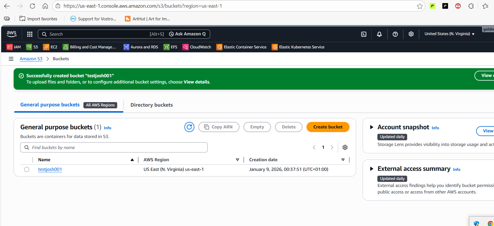
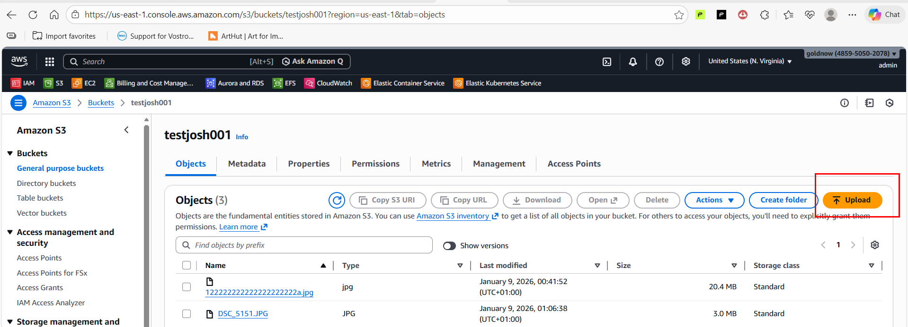
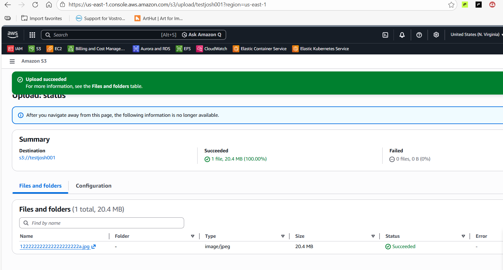
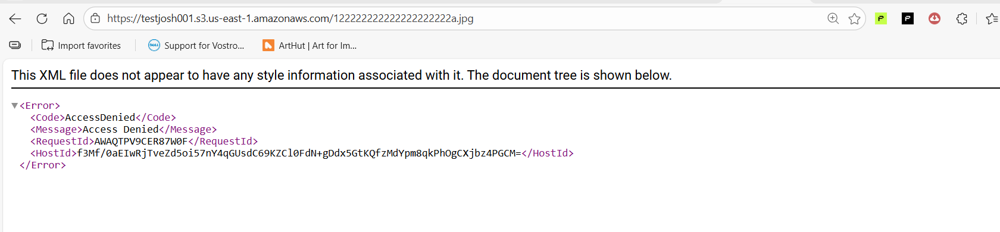
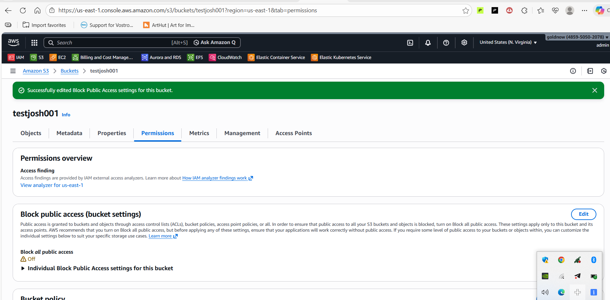

# Amazon S3 Practical Session – Report

## 1. Project Preparation and Repository Setup

Before starting the Amazon S3 practical session, I first created a **Git repository** to properly document my learning process, configurations, and screenshots. This ensured that all notes, exercises, and future updates were well organized and version-controlled.

I created the repository, added a README file, and used it as my central workspace for documenting everything I learned during the session. This helped me track progress clearly and maintain a structured workflow from the beginning.

---

## 2. Introduction to Amazon S3

In this session, I learned about **Amazon Simple Storage Service (Amazon S3)**. As the name suggests, S3 is designed to be simple to use, yet it supports a very wide range of real-world use cases. I learned that S3 is one of AWS’s **most popular and oldest services**, widely used across many industries.

Amazon S3 is a **storage service that is accessed over the internet**. It allows me to store **any amount of data at any time** and retrieve it from anywhere. I understood S3 by comparing it to services like **Google Drive or Dropbox**, but I also learned that S3 offers far more advanced features, scalability, and control.

---

## 3. Understanding Core S3 Concepts

I learned that Amazon S3 is an **object storage service**. This means:

* A **bucket** is the top-level container that holds data.
* An **object** is the actual data stored inside the bucket (such as documents, images, or videos).

Each bucket name must be **globally unique** because AWS generates an endpoint using the bucket name. I also learned that:

* Buckets have their own properties
* Objects have their own properties
* Permissions can be set at both the bucket and object levels

When data is uploaded to S3, it is automatically **replicated across multiple facilities**, and there is **no limit to the amount of data** that can be stored.

---

## 4. Real-World Use Cases of S3

One major use case I learned is storing application data for **EC2 instances**. Instead of storing files locally on an EC2 instance, applications can be programmed to store and retrieve files directly from S3.

Although this may sound similar to **Amazon EFS**, I learned the key difference:

* EFS is mounted at the operating system level
* S3 is accessed programmatically through applications (unless using tools like S3FS)

---

## 5. S3 Storage Classes and Cost Considerations

I studied the different **S3 storage classes**, understanding when and why each should be used:

* **S3 Standard** – Fast access, replicated across multiple Availability Zones
* **S3 Infrequent Access (IA)** – Lower cost for less frequently accessed data
* **S3 One Zone IA** – Lower cost, data stored in a single Availability Zone
* **S3 Intelligent-Tiering** – Automatically moves data to the most cost-effective tier
* **S3 Glacier** – Low-cost archival storage
* **S3 Glacier Deep Archive** – Lowest-cost storage with long retrieval times

I learned that durability across all storage classes remains extremely high, while availability and retrieval costs vary.

---

## 6. Lifecycle Policies

I learned how **lifecycle policies** help reduce storage costs by automatically moving objects between storage classes based on age. For example:

* After 30 days, move objects to Infrequent Access
* After 60 days, move to One Zone IA
* After 90 days, move to Glacier
* After one year, delete the objects

This is commonly used for **logs and archived data**.

---

## 7. S3 Pricing Model

I learned that Amazon S3 charges are based on:

1. Amount of data stored
2. Number of requests
3. Selected storage class
4. Data transfer and cross-region replication

---

## 8. Creating an S3 Bucket (Hands-On)

I logged into the AWS Console, searched for **S3**, and created a new bucket by following these steps:

* Selected **General Purpose** bucket type
* Chose the appropriate AWS region
* Provided a **globally unique bucket name**
* Left Object Ownership settings as default
* Kept **Block Public Access enabled**
* Enabled **Bucket Versioning**
* Selected **SSE-S3 encryption**
* Created the bucket successfully

---

## 9. Uploading Objects to the Bucket

I uploaded files (such as images,PDFs, vedios etc) to the bucket and observed that:

* Objects are **private by default**
* Storage class can be selected during upload
* Encryption settings can be customized per object

I reviewed all bucket and object tabs to understand available options.

---

## 10. Access Control and Public Access

I verified that copying the **object URL** initially resulted in an **Access Denied** error. This confirmed that objects are private by default.

To make an object public (only for demonstration purposes), I:

1. Enabled **ACLs** under Object Ownership
2. Disabled **Block Public Access**
3. Selected the object
4. Used **Actions → Make public using ACL**
5. Verified public access via the object URL

I also confirmed that:

* Making a bucket public does **not** automatically make objects public
* Public access must be granted explicitly per object

---

## 11. Uploading Additional Objects with Different Settings

I uploaded another object, selected a different **storage class**, and confirmed that:

* The object was still private
* Public access had to be manually enabled again

This reinforced my understanding of **object-level permissions**.

---

## 12. Conclusion

In this project, I successfully:

* Created a repository to document my work
* Learned Amazon S3 concepts from fundamentals to advanced options
* Created and configured an S3 bucket
* Uploaded and managed objects
* Controlled public and private access securely
* Understood storage classes, lifecycle policies, and pricing

This session gave me a strong foundation in Amazon S3 and prepared me for more advanced topics such as **static website hosting**, **cross-region replication**, and **integration with applications**.

---
